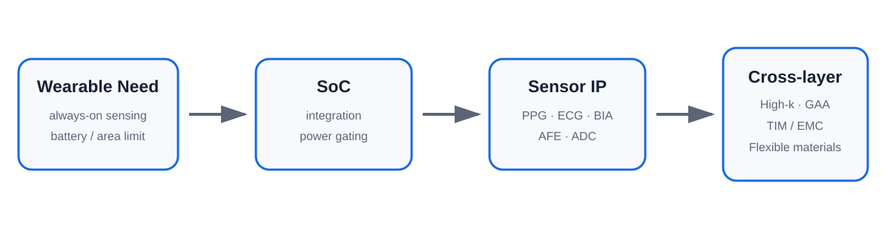
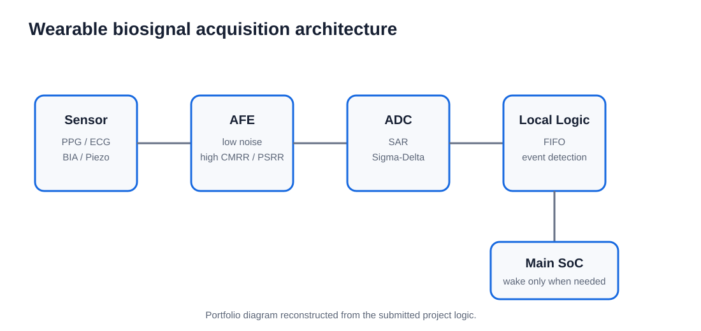

# Wearable Healthcare Low-Power SoC & Sensor IP

2026년 5–6월 **반도체개발프로세스** 교과목에서 수행한 팀 프로젝트입니다.

웨어러블 헬스케어 기기는 제한된 배터리와 작은 폼팩터 안에서 PPG, ECG, BIA 등 다양한 생체 신호를 상시 수집해야 합니다. 본 프로젝트는 이러한 제약을 해결하기 위해 **SoC 통합, Sensor IP, 저전력 회로/소자 전략, 첨단 공정·소재·패키징**이 어떻게 연결되는지를 시스템 관점에서 분석했습니다.

특히 저전력을 단순한 회로 설계 문제로 보지 않고, 다음과 같이 여러 레이어를 연결해 정리했습니다.

- SoC integration and interconnect reduction
- sensor IP reuse and low-power AFE/ADC architecture
- LDD / High-k 기반 leakage suppression
- subthreshold operation and smart wake-up
- GAA / SiP / FOPLP 등 제품 수준 기술
- TIM / EMC / flexible materials 등 신소재공학적 해법

> This repository summarizes a coursework technology-analysis project. It does not claim original chip design, circuit simulation, or wafer-measurement results.

---

## Project at a Glance

| Item | Summary |
|---|---|
| Course | 반도체개발프로세스 |
| Period | 2026.05–06 |
| Topic | 웨어러블 헬스케어용 초저전력 SoC 및 센서 IP |
| Target product | Smartwatch / wearable healthcare device |
| Core constraint | Battery-limited always-on operation |
| Main architecture | System on Chip (SoC) |
| Main IP focus | AFE, ADC, PPG, ECG, BIA, piezo / chemical sensor IP |
| Low-power focus | Leakage reduction, voltage scaling, power gating, event-driven operation |
| Materials/process link | High-k, GAA, thermal-interface materials, flexible materials |



---

## Why Low Power Is the Central Requirement

웨어러블 헬스케어 기기는 사용자의 생체 신호를 지속적으로 측정해야 하지만, 소형화 때문에 큰 배터리를 탑재하기 어렵습니다.

프로젝트에서는 이 문제를 해결하기 위해 여러 기능을 하나의 die 또는 package에 통합하고, 필요할 때만 특정 block을 활성화하는 **system-level power management**가 핵심이라고 정리했습니다.

SoC integration can reduce:

- board-level interconnect length
- parasitic resistance and capacitance
- data-transfer energy
- area overhead

and enables block-level power/clock gating.

---

## Sensor IP Landscape

The project reviewed representative biosignal-sensing IP blocks.

| Sensor / block | Signal or role | Key circuit concern |
|---|---|---|
| PPG | optical blood-volume / SpO₂-related signal | photodiode current, TIA noise |
| ECG | cardiac bio-potential | very high input impedance, low-noise instrumentation |
| BIA | complex body impedance | multi-frequency excitation and phase detection |
| AFE | analog biosignal conditioning | noise, CMRR, PSRR, input impedance |
| ADC | analog-to-digital conversion | resolution vs power |
| Piezo / chemical sensor | pressure / sweat-ion sensing | flexible interface, low-power readout |



---

## Three Low-Power Strategies

### 1. Static-Leakage Suppression

The project connects device-level leakage reduction to:

- optimized LDD impurity profile
- High-k gate dielectric such as HfO₂
- advanced gate electrostatics such as GAA

### 2. Voltage Scaling / Subthreshold Operation

Dynamic power approximately follows:

`P_dynamic ∝ C · V² · f`

Lowering the operating voltage can therefore provide a large power benefit, although current drive and noise margin must be considered.

### 3. Hardware Power Gating & Smart Wake-up

Instead of keeping the whole SoC active:

- minimum always-on logic remains awake
- main processing blocks enter deep sleep
- a meaningful biosignal event generates a hardware interrupt
- the main system wakes only when required

This limits unnecessary clock-switching and standby power.

---

## Company Technology Comparison

The submitted report compares three product strategies as representative examples.

| Company / platform | Main architecture highlighted in project | Low-power mechanism | Differentiating point |
|---|---|---|---|
| Samsung Exynos W1000 | 3 nm GAA | improved electrostatic control / leakage reduction | FOPLP / ePoP packaging |
| Apple S10 SiP | custom SiP + AOP | main-CPU power gating | vertical hardware-software optimization |
| Qualcomm wearable platform | heterogeneous CPU + AON coprocessor | workload partitioning | on-device AI / reduced communication activity |

> These rows preserve the framing of the 2026 course report. They are portfolio summaries of the submitted materials, not a live 2026 product-spec database.

---

## Materials & Process Connection

A key feature of the project was connecting system-level low-power design back to semiconductor materials and process engineering.

### High-k Gate Dielectric

Replacing very thin SiO₂ with HfO₂-based High-k material allows a physically thicker dielectric while maintaining a small equivalent oxide thickness, helping suppress direct tunneling leakage.

### Thermal Materials for SiP

Highly integrated wearable packages require thermal paths that protect nearby memory and sensor blocks.

The report discusses:

- Thermal Interface Material (TIM)
- Epoxy Molding Compound (EMC)
- BN / graphene / CNT fillers
- interface thermal resistance

### Flexible / Stretchable Materials

Wearable sensing also requires mechanical compatibility with skin.

The project reviews:

- PDMS
- Parylene
- flexible electrodes
- crack-type sensor structures

to connect mechanical reliability with sensor-signal integrity.

---

## Read the Project

| Page | Description |
|---|---|
| [Project Page](./index.html) | 프로젝트 전체 흐름 |
| [Navigation](./guide/00_navigation.md) | 전체 문서 안내 |
| [Project Overview](./guide/01_project_overview.md) | 시장 요구와 시스템 문제 정의 |
| [SoC Architecture](./guide/02_soc_architecture.md) | SoC 도입 이유와 저전력 메커니즘 |
| [Sensor IP](./guide/03_sensor_ip.md) | PPG, ECG, BIA, AFE, ADC |
| [Low-Power Strategies](./guide/04_low_power_strategies.md) | leakage, voltage scaling, power gating |
| [Company Comparison](./guide/05_company_comparison.md) | 삼성·애플·퀄컴 사례 |
| [Materials & Process](./guide/06_materials_process_link.md) | High-k, thermal, flexible materials |
| [Next-Generation Trends](./guide/07_next_gen_sensor_trends.md) | smart wake-up 및 차세대 센서 방향 |
| [Contribution & Evidence](./guide/08_contribution_and_evidence.md) | 제출 자료에서 확인 가능한 개인/팀 범위 |
| [Limitations](./guide/09_limitations_and_lessons.md) | 기술분석 프로젝트의 해석 범위 |
| [References](./references/README.md) | 보고서 참고문헌 |
| [Source Scope](./source/README.md) | 왜 실행 코드가 없는지 |

---

## Data Tables

- [low_power_strategy_matrix.csv](./results/low_power_strategy_matrix.csv)
- [sensor_ip_matrix.csv](./results/sensor_ip_matrix.csv)
- [company_comparison.csv](./results/company_comparison.csv)

These are structured summaries reconstructed from the submitted report, not experimental datasets.

---

## Repository Structure

```text
Wearable-Healthcare-Low-Power-SoC-Sensor-IP/
├── README.md
├── index.html
├── index.md
├── _config.yml
├── assets/
├── figures/
├── guide/
├── results/
├── study/
├── references/
├── appendix/
├── source/
└── report/
```

---

## Scope

This project is a **system-semiconductor technology analysis project**.

The repository does not claim:

- original SoC RTL design
- transistor-level circuit simulation
- fabricated device measurements
- original sensor hardware implementation

Its value lies in connecting **product requirement → SoC architecture → sensor IP → low-power device strategy → materials/process technology** within one development-oriented framework.

---

[← Back to Subin Joo's GitHub Portfolio](https://github.com/soybeanmilk0514-jpg)
